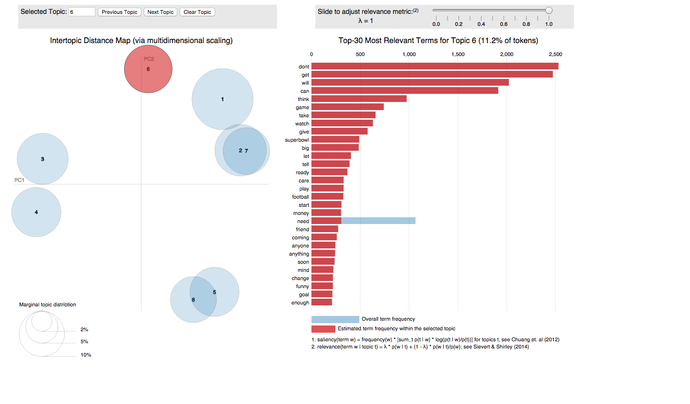
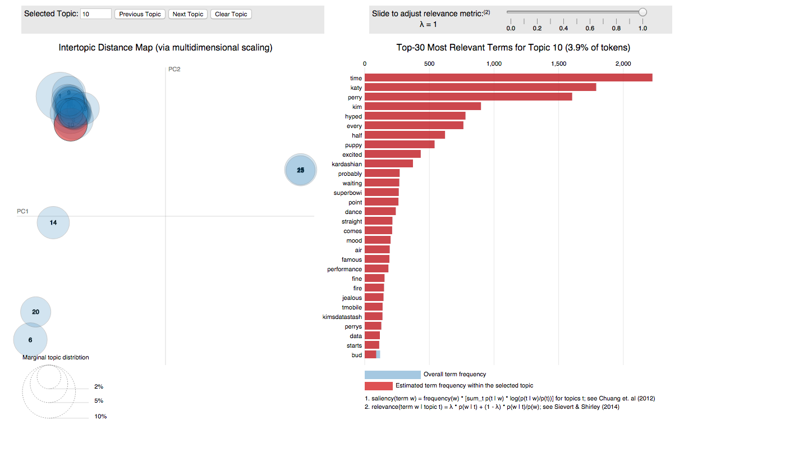
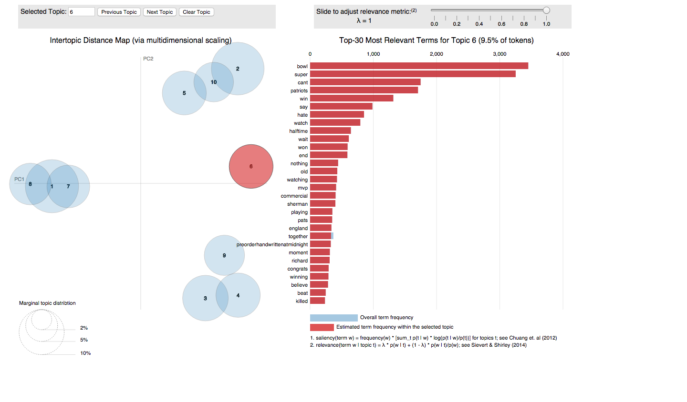
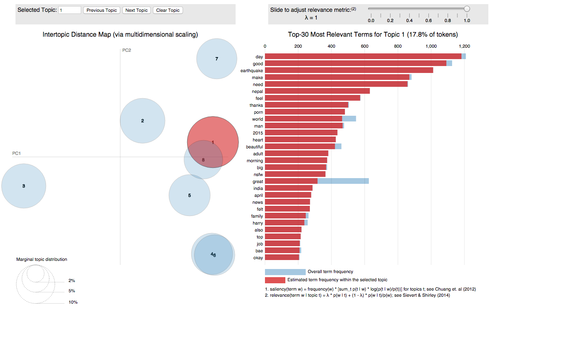
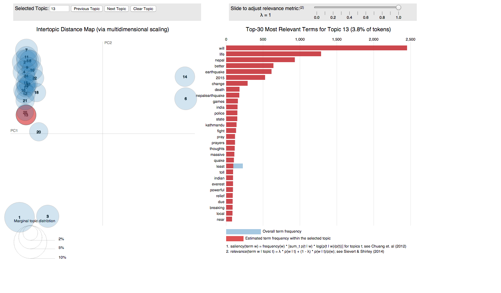

```{r, echo = FALSE}
par(cex = 0.8)
knitr::opts_chunk$set(fig.width=4, fig.height=4, fig.align = 'center', message = FALSE)
knitr::opts_chunk$set(echo = FALSE, warning = FALSE)
load("results/topicsvtime.Rdata")
```

For this project we used topic models to analyze Twitter's response to major events. More specifically, we used the maptpx package to fit Bayesian topics models to successive time intervals before and after the 2015 Superbowl and the Earthquake in Nepal. In this way we hoped to see Twitter react to these events and also how exactly they reacted. For example, Superbowl discussions could potentially be about the game, the players, or even the commercials. Similarly, Twitter users could talk about the Nepal Earthquake happening, the damage done by it, or ways to help. By fitting successive topic models we also wished to see how long topics related to these two events could be seen. The number of topics for each time interval was chosen independently and automatically by choosing the model with the highest Bayes factor. This resulted in models ranging from 8 to 25 topics. The results were visualized using the LDAVis package.   
  
Considering only the number of topics, there seems to be a weak trend with the time of day and the number of topics. Models fit later in the day typically had more topics than those fit early on. This matches up with Twitter activity as most Tweets are sent after noon local time. However, this relationship appears to be weak as the models fit on 4-28 show generally low topic numbers.  
```{r, fig.width = 8}
par(mfrow = c(1,2))
plot(superbowl_times, superbowl_topics, type = "l", format = "%m-%d", xlab = "Time", ylab = "Number of Topics", main = "Superbowl Topics over Time")
plot(nepal_times, nepal_topics, type = "l", format = "%m-%d", xlab = "Time", ylab = "Number of Topics", main = "Nepal Topics over Time")
``` 
  
The topic models fit showed a response to both of these events immediately after they happened. For the Superbowl, some topics relating to it were seen before the game started, but these topics simply referenced the game happening. During the game not only were there more topics in general, there were more topics referencing specific aspects of the Superbowl. For example, highlighted below is a topic discussing the half-time show of the game. Finally, after the game ended the topics began to condense again, resulting in 1 or 2 topics referencing the Superbowl as a whole. An example model for each of these time periods is shown below. More can be found on the referenced github page.    
  
Pre Superbowl 8 Topic Model:  

Mid Superbowl 25 Topic Model:     

Post Superbowl 10 Topic Model:  

  
Tweets immediately following the earthquake showed a response to the event, but this response was contained in a topic with other irrelevant terms. This is likely due to the fact that the event took place in the very early morning for most Americans, and this analysis was limited to English Tweets. As time passes a more nuanced Nepal topic forms, referencing the specific areas damaged. While there are not as many topics referencing Nepal as there were the Superbowl, there is still a noticeable response to this event very early on. In addition, while topics referencing the Superbowl die off within the period analyzed, terms referencing Nepal are seen throughout the full time period. Examples of these topics are given below.   
  
Immediately after Nepal 8 Topic Model:   

Post Nepal 25 Topic Model:    


In addition to these results we also produced an R package containing all of the code necessary to format Tweets for analysis. This package was designed for files downloaded using the streamR package and produces a folder of text files containing the edited tweets. The package also selects desired variables, filters stop words, cleans up links and other Twitter artifacts, and can produce a data frame ready for model fitting. This package can also be found on the referenced github.  
  
This project shows that topic models can be an effective method of event detection on Twitter and can also provide insight into how users are discussing these events. Both events were detected very shortly after they occurred, and the Superbowl generated numerous topics referencing unique aspects of the game. Not only do we know that people were talking about the game, we know that some were talking about the commercials, some were talking about the half-time show, and some were talking about the game or the players. This is a finer insight into Twitter's response to this event than simply noticing the response occurred. In addition this project produced an R package and code to ease others into the topic modeling process, hopefully allowing facilitating further analysis in this area.  
      
Github Links:  
R package: https://github.com/rturn/parseTweetFiles (not currently up to date, soon!)       
Paper and Results: http://github.com/rturn/Topic-Modeling-Twitter      